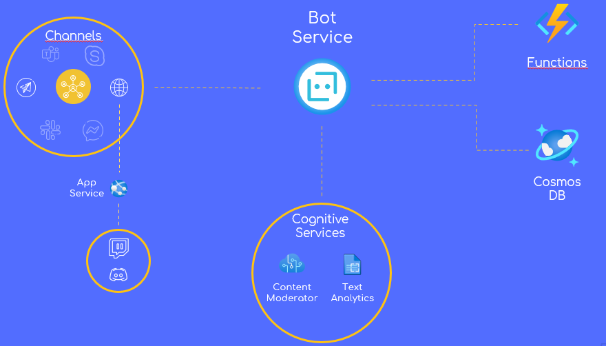

# **ModBot**

A tool for moderate language and contents in several chat platforms.

Developed by [Giovanni Iacovazzo](https://github.com/Giovannix97) and [Francesco Capriglione](https://github.com/kekkox) for Cloud Computing exam at the [Università degli Studi di Salerno](https://www.unisa.it/).

## **📋 Index**
- [Project idea](#💡-Project-Idea)
- [Architecture](#📐-Architecture)
- [Azure Tools](#🔧-Azure-Tools)
- [How to install](#👨‍💻-How-to-install)

## **💡 Project Idea**
### **Problem**
---
Everyday thousands of messages are sent through different instant messaging platform. With this amount of messages, take control over the chat is so stressful for chat moderators. Users that exchange messages in unappropriate way are a problem not only for moderators, but for users too.

### **Solution**
---
For the reasons explained before, we have implemented ModBot, a tool that can help moderators to manage their chats. 
Modbot can:

- Detect and remove hurtful messages
- Detect and remove sensible images (containing violence or pornography)
- Detect personal information exchanged in chat
- Detect message flooding
- Support multi languages and different chat platforms
- Warn and ban users who misbehave

About the ban, it isn't implemented in traditional way that kick-out users from chat, instead a banned user can still read messages exchanged in the chat, but can't interact in any other ways.

ModBot can work in all officially supported channels listed in the *[Channel Reference](https://docs.microsoft.com/en-us/azure/bot-service/bot-service-channels-reference?view=azure-bot-service-4.0)*. For other platforms 

## **📐 Architecture**



In the image above, the Modbot architecture is illustrated. Modbot can receive messages from different channels which are divided into two main categories:
1. Channels [officially supported](https://docs.microsoft.com/en-us/azure/bot-service/bot-service-channels-reference?view=azure-bot-service-4.0) by the Bot Service
2. Channels that aren't offically supported.

For the first one, no special intervention is required. For the second one, however, it's necessary to implement your own Direct Line mechanism, as done for [discord](https://github.com/Giovannix97/ModBot/tree/main/direct%20lines/Discord) and [twitch](https://github.com/Giovannix97/ModBot/tree/main/direct%20lines/Twitch), both hosted on App Service.

When a message coming from the channels, it's collected by the bot service that:

1. Check on *CosmosDB* if the user is banned. If it's true, the user somehow managed to write on the channel even though he shouldn't have. ModBot will simply delete any messages sent by this user until his ban expires.
2. The latest messages (including the one just received) are analyzed to check if the user is flooding the chat 
3. The content of the message is sent to the *Content Moderator* who is responsible for checking that there are no offenses (direct and indirect) or that the image sent is not intended for an adult audience. 
4. If misconduct is detected in *2* or *3*:

     - A warning message is sent in the same language in which the user wrote the message 
     - In the event that the user has exceeded the maximum number of warnings, a message will be sent to inform user that he has been banned. 


## **🔧 Azure Tools**
For this project we have used this tools provided by Azure:
- [Cosmos DB](https://azure.microsoft.com/en-us/services/cosmos-db): for reading / storing data about users and channels in which they talk.- App Service: for hosting ModBot and direct lines servers.
- [Azure Functions](https://azure.microsoft.com/en-us/services/functions): HTTP triggered for message management and ban mechanism, Time Triggered for unban mechanism.
- [Bot Service](https://azure.microsoft.com/en-us/services/bot-services): The core of the bot
- [Content Moderator](https://azure.microsoft.com/en-us/services/cognitive-services/content-moderator): processes text and images to detect inappropriate content.
- [Text Analytics](https://azure.microsoft.com/en-us/services/cognitive-services/text-analytics): detect personal information exchanged in the chat

## **👨‍💻 How to install**
### **Prerequisites**
---

- [Node.js](https://nodejs.org) version 10.14.1 or higher

    ```bash
    # determine node version
    node --version
    ```

- [Azure CLI](https://docs.microsoft.com/en-us/cli/azure/what-is-azure-cli) version 2.18.0 or higher. You can install it from [here](https://docs.microsoft.com/en-us/cli/azure/install-azure-cli)

### **Before start**
---
Make sure you have setted all enviroment variables in `.env` file.

```sh
ContentModeratorKey=CONTENT_MODERATOR_KEY
ContentModeratorEndpoint=CONTENT_MODERATOR_ENDPOINT

CosmosDbKey=COSMOS_DB_KEY
CosmosDbEndpoint=COSMOS_DB_ENDPOINT
DatabaseId=DATABASE_NAME
ContainerId=USER_CONTAINER_NAME
PartitionKey=USER_PARTITION_KEY
ChannelConversationContainerId=CHANNEL_CONVERSATION_CONTAINER_NAME
ChannelConversationPartitionKey=CHANNEL_CONVERSATION_CONTAINER_PARTITION_KEY

AzureFunctionURL=AZURE_FUNCTION_ENDPOINT
BanFunctionKey=BAN_FUNCTION_AUTH_KEY
UnbanFunctionKey=UNBAN_FUNCTION_AUTH_KEY
```

Then install modules

```bash
npm install
```

### **To run the bot locally**
---

> ⚠️**WARNING!** Image detection mechanism does not work in local enviroment. ⚠️

[Bot Framework Emulator](https://github.com/microsoft/botframework-emulator) is a desktop application that allows bot developers to test and debug their bots on localhost or running remotely through a tunnel.

- Install the Bot Framework Emulator version 4.9.0 or greater from [here](https://github.com/Microsoft/BotFramework-Emulator/releases)

### Connect to the bot using Bot Framework Emulator
---

- Start the bot

    ```bash
    npm start
    ```
- Launch Bot Framework Emulator
- File -> Open Bot
- Enter a Bot URL of `http://localhost:3978/api/messages`
- Enjoy! 

### **Deploy the bot to Azure**
---
In this section we learn how to deploy the bot on azure: we cover the dep
### Before deploy
---

Before you start with deploying, make sure that you have started the services listed in [this sections](#🔧-Azure-Tools).

Before you deploy the bot, you must generate `web.config` file.

```bash
az bot prepare-deploy --code-dir "<PATH_TO_THIS_PROJECT>" --lang Javascript
```

In alternative, you can use the `web.config` file provided [there](https://github.com/Giovannix97/ModBot/blob/main/web.config).

### Manual deploy
---
There are several ways to deploy but we'll focus on manual deploy.
Make a .zip file containing:

> 📁 node_modules  
> 📁 services  
> 📄 .env  
> 📄 .eslintrc.js  
> 📄 bot.js  
> 📄 index.js  
> 📄 locales.js  
> 📄 web.config

Now go on `https://YOUR_BOT_SERVICE_NAME.scm.azurewebsites.net/ZipDeployUI` and:

- delete all files listed there
- Drag and drop your zip file
- Wait (up to 10 minutes)

**🎉TADA!🎉** 
Your bot is ready!

### Other way to deploy
---

To learn more about deploying a bot to Azure, see [Deploy your bot to Azure](https://aka.ms/azuredeployment) for a complete list of deployment instructions.

### **How to install direct line**
---
First of all you must go to direct lines folder. For example

```bash
cd '.\direct lines\Discord'
```

Then install dependencies
```bash
npm install
```

Now, you can create a .zip file containing:
> 📁 node_modules  
> 📄 .env  
> 📄 discord-direct-line.js  

Deploy this file in the app service of the bot as a webjob or deploy as a different app service.

## Further reading

- [Bot Framework Documentation](https://docs.botframework.com)
- [Bot Basics](https://docs.microsoft.com/azure/bot-service/bot-builder-basics?view=azure-bot-service-4.0)
- [Activity processing](https://docs.microsoft.com/en-us/azure/bot-service/bot-builder-concept-activity-processing?view=azure-bot-service-4.0)
- [Azure Bot Service Introduction](https://docs.microsoft.com/azure/bot-service/bot-service-overview-introduction?view=azure-bot-service-4.0)
- [Azure Bot Service Documentation](https://docs.microsoft.com/azure/bot-service/?view=azure-bot-service-4.0)
- [Azure CLI](https://docs.microsoft.com/cli/azure/?view=azure-cli-latest)
- [Azure Portal](https://portal.azure.com)
- [Channels and Bot Connector Service](https://docs.microsoft.com/en-us/azure/bot-service/bot-concepts?view=azure-bot-service-4.0)
- [Restify](https://www.npmjs.com/package/restify)
- [dotenv](https://www.npmjs.com/package/dotenv)
